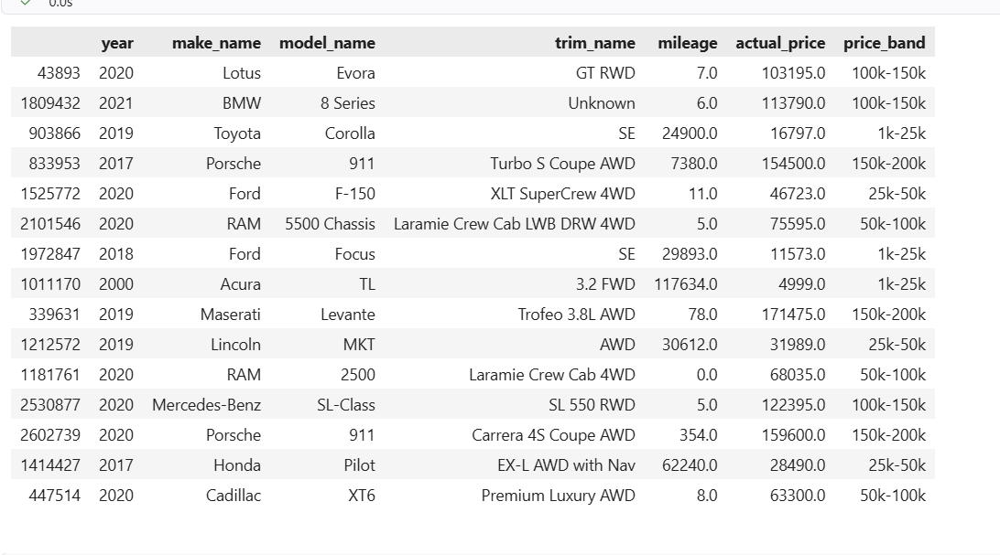

# Prediction Examples

These vehicles come from the held-out test set. Their actual advertised prices are shown below.

Copy any JSON example below, paste it into the `/predict` request body, and click **Execute**.

## 2020 Lotus Evora GT RWD

Actual advertised price: $103,195

{
  "city": "Summit",
  "make_name": "Lotus",
  "model_name": "Evora",
  "trim_name": "GT RWD",
  "engine_type": "V6",
  "frame_damaged": "Not Reported",
  "fuel_type": "Gasoline",
  "has_accidents": "Not Reported",
  "salvage": "Not Reported",
  "transmission": "A",
  "wheel_system": "RWD",
  "horsepower": 422.0,
  "mileage": 7.0,
  "owner_count": 0.0,
  "year": 2020,
  "is_new": true,
  "mileage_missing": 0,
  "horsepower_missing": 0,
  "Condition_reported": false,
  "new_mileage_conflict": false,
  "used_owner_count_missing": false
}

## 2019 Toyota Corolla SE

Actual advertised price: $16747

{
  "city": "Pittsburgh",
  "make_name": "Toyota",
  "model_name": "Corolla",
  "trim_name": "SE",
  "engine_type": "I4",
  "frame_damaged": "False",
  "fuel_type": "Gasoline",
  "has_accidents": "False",
  "salvage": "False",
  "transmission": "A",
  "wheel_system": "FWD",
  "horsepower": 132.0,
  "mileage": 24900.0,
  "owner_count": 1.0,
  "year": 2019,
  "is_new": false,
  "mileage_missing": 0,
  "horsepower_missing": 0,
  "Condition_reported": true,
  "new_mileage_conflict": false,
  "used_owner_count_missing": false
}

## 2021 BMW 8 Series

Actual advertised price: $113,790

{
  "city": "O Fallon",
  "make_name": "BMW",
  "model_name": "8 Series",
  "trim_name": "Unknown",
  "engine_type": "Unknown",
  "frame_damaged": "Not Reported",
  "fuel_type": "Unknown",
  "has_accidents": "Not Reported",
  "salvage": "Not Reported",
  "transmission": "A",
  "wheel_system": "Unknown",
  "horsepower": 345.0,
  "mileage": 6.0,
  "owner_count": 0.0,
  "year": 2021,
  "is_new": true,
  "mileage_missing": 1,
  "horsepower_missing": 1,
  "Condition_reported": false,
  "new_mileage_conflict": false,
  "used_owner_count_missing": false
}

## 2017 Porsche 911 Turbo S Coupe AWD

Actual advertised price: $154,500

{
  "city": "Kingsport",
  "make_name": "Porsche",
  "model_name": "911",
  "trim_name": "Turbo S Coupe AWD",
  "engine_type": "H6",
  "frame_damaged": "False",
  "fuel_type": "Gasoline",
  "has_accidents": "False",
  "salvage": "False",
  "transmission": "A",
  "wheel_system": "AWD",
  "horsepower": 580.0,
  "mileage": 7380.0,
  "owner_count": 2.0,
  "year": 2017,
  "is_new": false,
  "mileage_missing": 0,
  "horsepower_missing": 0,
  "Condition_reported": true,
  "new_mileage_conflict": false,
  "used_owner_count_missing": false
}

## 2020 Ford F-150 XLT SuperCrew 4WD

Actual advertised price: $46,723

{
  "city": "North Little Rock",
  "make_name": "Ford",
  "model_name": "F-150",
  "trim_name": "XLT SuperCrew 4WD",
  "engine_type": "V6",
  "frame_damaged": "Not Reported",
  "fuel_type": "Gasoline",
  "has_accidents": "Not Reported",
  "salvage": "Not Reported",
  "transmission": "A",
  "wheel_system": "4WD",
  "horsepower": 375.0,
  "mileage": 11.0,
  "owner_count": 0.0,
  "year": 2020,
  "is_new": true,
  "mileage_missing": 0,
  "horsepower_missing": 0,
  "Condition_reported": false,
  "new_mileage_conflict": false,
  "used_owner_count_missing": false
}

## 2020 RAM 5500 Chassis Laramie Crew Cab LWB DRW 4WD

Actual advertised price: $75,595

{
  "city": "Avondale",
  "make_name": "RAM",
  "model_name": "5500 Chassis",
  "trim_name": "Laramie Crew Cab LWB DRW 4WD",
  "engine_type": "Unknown",
  "frame_damaged": "Not Reported",
  "fuel_type": "Unknown",
  "has_accidents": "Not Reported",
  "salvage": "Not Reported",
  "transmission": "A",
  "wheel_system": "Unknown",
  "horsepower": 345.0,
  "mileage": 5.0,
  "owner_count": 0.0,
  "year": 2020,
  "is_new": true,
  "mileage_missing": 0,
  "horsepower_missing": 1,
  "Condition_reported": false,
  "new_mileage_conflict": false,
  "used_owner_count_missing": false
}

## 2018 Ford Focus SE

Actual advertised price: $11,573

{
  "city": "Tempe",
  "make_name": "Ford",
  "model_name": "Focus",
  "trim_name": "SE",
  "engine_type": "Unknown",
  "frame_damaged": "False",
  "fuel_type": "Unknown",
  "has_accidents": "False",
  "salvage": "False",
  "transmission": "Unknown",
  "wheel_system": "FWD",
  "horsepower": 160.0,
  "mileage": 29893.0,
  "owner_count": 1.0,
  "year": 2018,
  "is_new": false,
  "mileage_missing": 0,
  "horsepower_missing": 0,
  "Condition_reported": true,
  "new_mileage_conflict": false,
  "used_owner_count_missing": false
}

## 2000 Acura TL 3.2 FWD

Actual advertised price: $4,999

{
  "city": "Norcross",
  "make_name": "Acura",
  "model_name": "TL",
  "trim_name": "3.2 FWD",
  "engine_type": "V6",
  "frame_damaged": "False",
  "fuel_type": "Gasoline",
  "has_accidents": "False",
  "salvage": "False",
  "transmission": "A",
  "wheel_system": "FWD",
  "horsepower": 225.0,
  "mileage": 117634.0,
  "owner_count": 3.0,
  "year": 2000,
  "is_new": false,
  "mileage_missing": 0,
  "horsepower_missing": 0,
  "Condition_reported": true,
  "new_mileage_conflict": false,
  "used_owner_count_missing": false
}

## 2019 Maserati Levante Trofeo 3.8L AWD

Actual advertised price: $171,475

{
  "city": "Willow Grove",
  "make_name": "Maserati",
  "model_name": "Levante",
  "trim_name": "Trofeo 3.8L AWD",
  "engine_type": "V8",
  "frame_damaged": "Not Reported",
  "fuel_type": "Gasoline",
  "has_accidents": "Not Reported",
  "salvage": "Not Reported",
  "transmission": "A",
  "wheel_system": "AWD",
  "horsepower": 590.0,
  "mileage": 78.0,
  "owner_count": 0.0,
  "year": 2019,
  "is_new": true,
  "mileage_missing": 0,
  "horsepower_missing": 0,
  "Condition_reported": false,
  "new_mileage_conflict": false,
  "used_owner_count_missing": false
}

## 2019 Lincoln MKT AWD

Actual advertised price: $31,989

{
  "city": "Hiawatha",
  "make_name": "Lincoln",
  "model_name": "MKT",
  "trim_name": "AWD",
  "engine_type": "V6",
  "frame_damaged": "False",
  "fuel_type": "Gasoline",
  "has_accidents": "False",
  "salvage": "False",
  "transmission": "A",
  "wheel_system": "AWD",
  "horsepower": 365.0,
  "mileage": 30612.0,
  "owner_count": 1.0,
  "year": 2019,
  "is_new": false,
  "mileage_missing": 0,
  "horsepower_missing": 0,
  "Condition_reported": true,
  "new_mileage_conflict": false,
  "used_owner_count_missing": false
}

## 2020 RAM 2500 Laramie Crew Cab 4WD

Actual advertised price: $68,035

{
  "city": "New Smyrna Beach",
  "make_name": "RAM",
  "model_name": "2500",
  "trim_name": "Laramie Crew Cab 4WD",
  "engine_type": "I6 Diesel",
  "frame_damaged": "Not Reported",
  "fuel_type": "Diesel",
  "has_accidents": "Not Reported",
  "salvage": "Not Reported",
  "transmission": "A",
  "wheel_system": "4WD",
  "horsepower": 370.0,
  "mileage": 0.0,
  "owner_count": 0.0,
  "year": 2020,
  "is_new": true,
  "mileage_missing": 0,
  "horsepower_missing": 0,
  "Condition_reported": false,
  "new_mileage_conflict": false,
  "used_owner_count_missing": false
}

## 2020 Mercedes-Benz SL-Class SL 550 RWD

Actual advertised price: $122,395

{
  "city": "Newport Beach",
  "make_name": "Mercedes-Benz",
  "model_name": "SL-Class",
  "trim_name": "SL 550 RWD",
  "engine_type": "V8",
  "frame_damaged": "Not Reported",
  "fuel_type": "Gasoline",
  "has_accidents": "Not Reported",
  "salvage": "Not Reported",
  "transmission": "A",
  "wheel_system": "RWD",
  "horsepower": 449.0,
  "mileage": 5.0,
  "owner_count": 0.0,
  "year": 2020,
  "is_new": true,
  "mileage_missing": 0,
  "horsepower_missing": 0,
  "Condition_reported": false,
  "new_mileage_conflict": false,
  "used_owner_count_missing": false
}

## 2020 Porsche 911 Carrera 4S Coupe AWD

Actual advertised price: $159,600

{
  "city": "Seaside",
  "make_name": "Porsche",
  "model_name": "911",
  "trim_name": "Carrera 4S Coupe AWD",
  "engine_type": "H6",
  "frame_damaged": "Not Reported",
  "fuel_type": "Gasoline",
  "has_accidents": "Not Reported",
  "salvage": "Not Reported",
  "transmission": "A",
  "wheel_system": "AWD",
  "horsepower": 443.0,
  "mileage": 354.0,
  "owner_count": 0.0,
  "year": 2020,
  "is_new": true,
  "mileage_missing": 0,
  "horsepower_missing": 0,
  "Condition_reported": false,
  "new_mileage_conflict": false,
  "used_owner_count_missing": false
}

## 2017 Honda Pilot EX-L AWD with Nav

Actual advertised price: $28,490

{
  "city": "Inver Grove Heights",
  "make_name": "Honda",
  "model_name": "Pilot",
  "trim_name": "EX-L AWD with Nav",
  "engine_type": "V6",
  "frame_damaged": "False",
  "fuel_type": "Gasoline",
  "has_accidents": "False",
  "salvage": "False",
  "transmission": "A",
  "wheel_system": "AWD",
  "horsepower": 280.0,
  "mileage": 62240.0,
  "owner_count": 1.0,
  "year": 2017,
  "is_new": false,
  "mileage_missing": 0,
  "horsepower_missing": 0,
  "Condition_reported": true,
  "new_mileage_conflict": false,
  "used_owner_count_missing": false
}

## 2020 Cadillac XT6 Premium Luxury AWD

Actual advertised price: $63,300

{
  "city": "Rochester",
  "make_name": "Cadillac",
  "model_name": "XT6",
  "trim_name": "Premium Luxury AWD",
  "engine_type": "V6",
  "frame_damaged": "Not Reported",
  "fuel_type": "Gasoline",
  "has_accidents": "Not Reported",
  "salvage": "Not Reported",
  "transmission": "A",
  "wheel_system": "4WD",
  "horsepower": 310.0,
  "mileage": 8.0,
  "owner_count": 0.0,
  "year": 2020,
  "is_new": true,
  "mileage_missing": 0,
  "horsepower_missing": 0,
  "Condition_reported": false,
  "new_mileage_conflict": false,
  "used_owner_count_missing": false
}