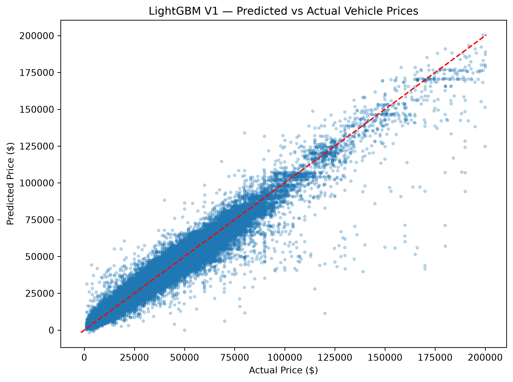
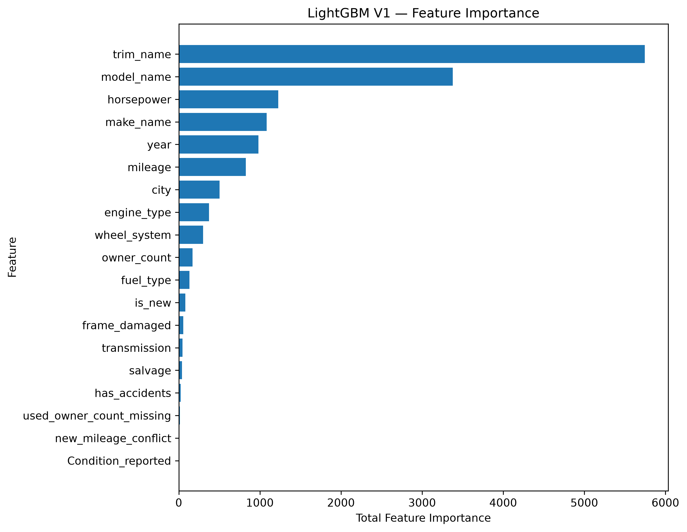
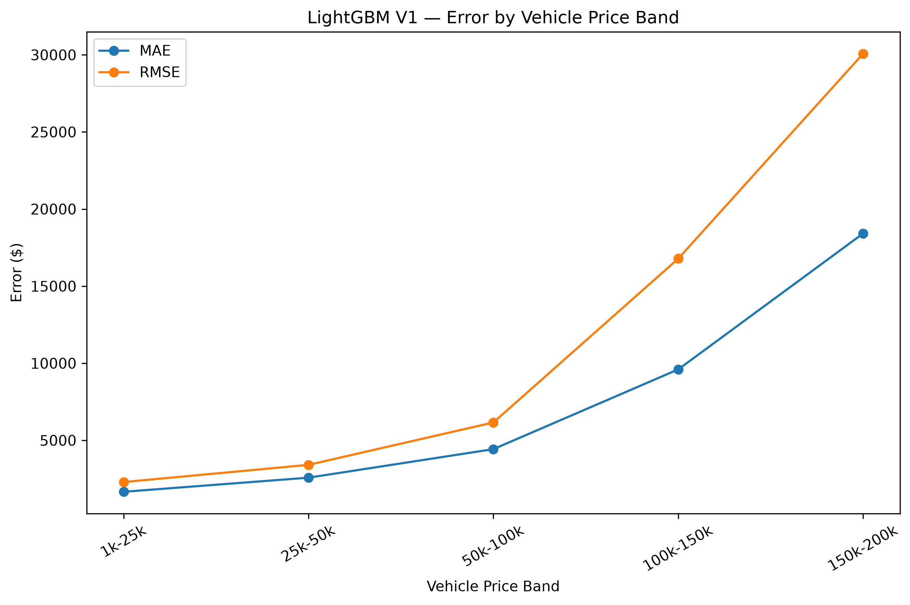

# Vehicle Valuation Platform — V1 Results

## V1 Scope

V1 predicts the current market value of used vehicles within a supported
price range of $1,000 to $200,000.

The model is intended for vehicles and market conditions represented by the
training data and should not be interpreted as supporting all possible vehicles.

## Final Model

LightGBM (`LGBMRegressor`)

### Configuration

- n_estimators: 500
- max_depth: 20
- learning_rate: 0.1
- num_leaves: 31
- subsample: 0.8
- colsample_bytree: 0.8
- force_row_wise: True
- random_state: 42
- n_jobs: -1

## Training

- Training observations: 2,128,455
- Processed features: 10,521

## Final Performance

| Split | MAE | RMSE | R² |
|---|---:|---:|---:|
| Train | — | $3,623.84 | — |
| Validation | $2,380.11 | $3,660.04 | 0.9567 |
| Test | $2,379.00 | $3,685.29 | 0.9557 |

The test set was held out from model development and used for final V1 evaluation.

## Error Analysis

Performance degraded as vehicle price increased.

The highest price bands contained substantially fewer observations than the
dominant used-vehicle price range, resulting in larger errors for high-value
vehicles.

V1 therefore performs most reliably across the well-represented portion of its
supported market, while high-value vehicles remain an area for future data
enrichment and model development.

## V1 Status

V1 model development is complete.

No further hyperparameter tuning will be performed using the V1 test results.
Future modeling changes will be treated as subsequent project versions.